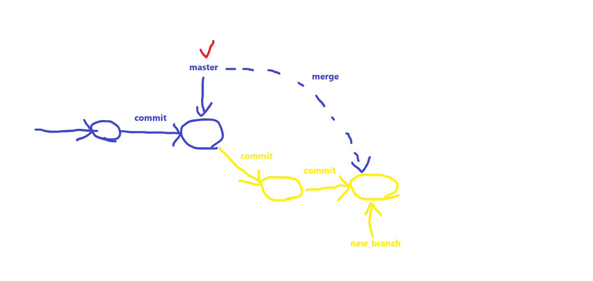

# git
## 기초

Git의 Repository 구조는 크게 세가지로 구성되어있다.
```
작업폴더(Working directory) > 인덱스(Staging Area) > 저장소(Head -Repository) 
```
우리가 작업하는 폴더를 `작업트리(Working directory)` 라고 부르며 commit을 실행하기 전에 작업트리와 저장소 사이에 존재하는 가상의 준비 영역(Staging Area)을 `인덱스(Index)`라고 한다.

저장소에 commit하기 위해서 먼저 추가(Untracked files) 및 변경(Modified files) 하고자 하는 파일을 먼저 `인덱스에 기록(Stage)`하고 이후 스테이징된 목록만 최종적으로 commit 명령어에 의해 저장소에 공개하게 됩니다.

.gitignore 파일 생성 시 https://www.toptal.com/developers/gitignore 사이트를 이용하면 편하게 생성할 수 있다. 사용법은 windows, python, Django 같은 단어들을 개별적으로 검색해서 추가하고 생성버튼을 누르면 된다.

### 쉬운 설명

영화 촬영에 비교하여 설명한다.

영화를 촬영하려면 3가지 공간이 필요하다.

1. 분장실 (작업트리, working directory)
2. 스테이지 (stage, 인덱스)
3. 커밋들 (commits)

이때, 1 → 2에서 가는 명령이 add이고, 2 → 3으로 가는 명령이 commit이고 뒤로 가는 명령 (reset, pull)도 존재한다.


### git 사용 전 주의사항
1. 현재 위치를 잘 확인한다.
2. 리포지토리 안에 리포지토리를 만들지 않는다. (git init을 한 곳안에 하위 폴더를 만들고 그 하위 폴더에서 git init을 하지 않는다.)
3. home(~) 디렉토리에서 init 하지 않는다. → 2번과도 같은 이유이다.
4. git을 잘 쓸줄 모르면(브랜치 개념이 없으면) github에서 직접 수정하지 않는다.


### git 사용 중 추천사항
1. 커밋 메시지는 짧지만 내용을 담을 것.
2. 모든 Repo(프로젝트)는 README.md, .gitingnore 파일을 만들 것.


## git 시스템 관련

### 이름 / 이메일 설정 (git 사용 전 설정 필요)
1. 이름을 설정한다.
   ```
   $ git config --global user.name "name"
   $ git config user.name
   ```

2. 이메일 주소를 설정한다. (G메일 권장)
   ```
   $ git config --global user.email "email@gmail.com"
   $ git config user.email
   ```

### config
git의 config 설정을 확인한다. 빠져나오고 싶지만 프롬프트 `$`가 나타나지 않는 경우 `Q`를 누르면 빠져나올 수 있다.

#### 사용법
|옵션|설명|예시|
|-|-|-|
|--list|config 리스트를 출력한다.|`$ git config --list`|
|--list|config에 이름을 등록한다.|`$ git config --global user.name 'name'`|
|--list|config에 이메일을 등록한다.|`$ git config --global user.email 'email@gmail.com'`|
|--list|config에 등록된 이름을 출력한다.|`$ git config --user.name`|
|--list|config에 등록된 이메일을 출력한다.|`$ git config --user.email`|

### status
현재 git의 상태를 나타낸다. 현재 스테이징 / 커밋된 파일이 나타나 push가 필요한 파일을 알 수 있다.

#### 사용법
```
$ git status
```

### log
커밋 히스토리를 조회한다. config 확인과 마찬가지로 빠져나오고 싶으면 `Q`를 누른다.

#### 사용법
```
$ git log
$ git log --oneline
$ git log --oneline --graph   # 깃 commit 로그를 자세히 출력한다. (그래프 포함)
```


## 로컬저장소 업데이트

### 로컬저장소 생성
현재 디렉토리를 로컬 저장소로 만든다.(.git 폴더 생성)  
이걸 해야 본격적으로 git을 사용할 수 있다.

#### 사용법
```
$ git init
```

### 로컬저장소 해제
.git 디렉토리를 삭제하면 해당 디렉토리의 로컬저장소가 해제된다.

#### 사용법
```
$ rm -rf .git
```


### add
특정 파일을 stage에 올린다.

#### 사용법
```
$ git add a.txt
$ git add .
```

#### 스테이징된 파일 되돌리기
`git rm --cached <file>...` 명령을 사용하여 스테이징된 파일을 되돌린다.

##### 사용법
```
$ git rm --cached a.txt
```


### commit
스테이징된 파일을 최종 확정한다.

#### 사용법
```
$ git commit -m a.txt '변경 메시지'
$ git commit -a -m a.txt '변경 메시지'    # add와 commit을 한번에 한다.
```


### reset
스테이징된 파일을 되돌린다. 

#### 옵션
- reset 옵션
  - -soft : index 보존(add한 상태, staged 상태), 워킹 디렉터리의 파일 보존. 즉 모두 보존.
  - -mixed : index 취소(add하기 전 상태, unstaged 상태), 워킹 디렉터리의 파일 보존 (기본 옵션)
  - -hard : index 취소(add하기 전 상태, unstaged 상태), 워킹 디렉터리의 파일 삭제. 즉 모두 취소.
  <!-- TODO : HEAD 내용 추가 필요 -->
  - HEAD : 추가 필요

#### 사용법
```
# git reset a.txt
```

### restore
특정 커밋으로 되돌리거나 unstaging한다.

#### 사용법
```
$ git restore a.txt
```

## 브랜치(branch)

### 개념

이름 그대로 **가지**라는 의미이다. 첫 브랜치는 자동으로 master라는 이름으로 시작되며, 후술된 명령을 통해 브랜치를 생성하고, 포인터를 변경하는 등 제어가 가능하다.

그림 해설
|명령 OR 기호|의미|
|-|-|
|commit|위에서 설명한 그 commit 맞다. 커밋할 때마다 저 원이 하나씩 생긴다.|
|붉은색 체크|하단의 후술된 포인터(HEAD)이다. 현재 작업중인 브랜치를 의미한다.|
|merge|브랜치를 병합한다. 그림에 나와있는 병합의 종류는 Fast Forward(FF)병합이다.|

### branch
브랜치를 생성, 삭제, 조회한다.

#### 사용법
master자리에 각 이름을 넣어 사용한다.

```
$ git branch                # 생성된 브랜치명 확인
$ git branch -M <브랜치명>   # 브랜치 생성
$ git branch -a <브랜치명>   # 브랜치 삭제
```

### HEAD(포인터) 변경
생성된 브랜치를 가리키는 **포인터(HEAD)**를 변경한다.

#### 사용법

```
$ git switch new_branch       # 구버전 명령어
$ git switch -c new_branch    # b2 브랜치가 없으면 만들면서 스위치
$ git checkout new_branch     # 신버전 명령어 (switch와 동일)
$ git branch -v               # 생성된 브랜치명 자세히 확인
```

### Merge
브랜치를 병합한다. 이때, 병합의 기준은 경우의 수에 따라 다르다.

#### Merge 시나리오
1. Fast Forward
2. Automatic Merge
3. CONFLICT => Manual Commit

|시나리오 종류|설명|
|-|-|
|Fast Forward(FF)|브랜치 개념의 그림과 같은 상황이다. 병합을 원하는 분기의 커밋수만 차이날때 적용된다.|
|Automatic Merge|FF 시나리오에서 자기자신(분기)에도 커밋이 일어났지만, 병합 대상 분기의 내용과 겹치는게 없을때 발생한다. <br> 이 경우에도 FF와 같이 사용자가 특별히 수정해야할 사항은 없다.|
|CONFLICT|병합이 될 두 분기의 커밋수도 차이나고, 그 커밋에서 겹치는 내용이 존재할 때 발생한다. 이 경우, git이 개입할 수 없어 병합 조건을 사용자에게 정하게 한다. <br> 조건은 아래와 같이 네 가지 경우의 수가 존재한다. <br> - income 분기(병합되어질)의 내용만 merge 한다. <br> - 병합대상 분기의 내용만 merge한다. <br> - 두 분기의 내용을 전부 포함시킨다. <br> - <!-- TODO : 분기 내용 추가. -->|


#### 사용법
```
$ git merge new_branch
$ git log --oneline --graph   # 깃 commit 로그를 자세히 출력한다. (그래프 포함)
```


## 깃허브 리포지토리 연결 / 갱신 / 내려받기 (remote, push, pull, clone)

커밋된 파일들을 깃허브 리포지토리에 갱신하거나, 갱신된 깃헙 리포지토리의 내용들을 로컬저장소에 내려받을 수 있다.


### remote
원격 저장소를 생성한다. git remote add `<name>` `<URL>`의 형태로 사용되며, URL(리포지토리)과 name(원격 저장소)을 매핑하거나 삭제한다.

#### 사용법
```
$ git remote add <origin> https://github.com/CatSaveTheWorld/Daily_study.git
$ git remote -v         # 등록된 원격 저장소 확인
$ git remote rm <origin>  # 원격 저장소 삭제
```

### push
git push `<name>` `<브랜치명>`의 형태로 사용되며, 이 작업을 해야 비로소 커밋한 내용이 리포지토리에 올라간다.

#### 사용법
```
$ git push origin master
```

### clone
로컬저장소에 **아무것도 없을때** (.git 폴더), 깃허브 리포지토리로부터 파일을 내려받는다. 

#### 사용법
```
$ git clone https://github.com/CatSaveTheWorld/Daily_study.git
```

### pull
깃허브 리포지토리로부터 **갱신된 내용**을 내려받는다. 

#### 사용법
```
$ git pull origin master
```

## 정리
위 내용을 표로 만들어 정리하면 다음과 같다.

​
|상황|명령어|
|--|--|
|집에서 새로운 프로젝트 시작|`$ mkdir project`|
|프로젝트 폴더로 이동|`$ cd project`|
|리포 초기화|`$ git init`|
|README, .gitignore 생성|`$ touch README.md .gitignore`|
|파일 스테이징|`$ git add .`|
|커밋|`$ git commit -m 'first commit'`|
|원격저장소 생성|github 사이트에서 진행|
|원격 저장소 등록|`$ git remote add origin <URL>`|
|원격 저장소 PUSH|`$ git push origin master`|
|다른 컴퓨터에서 원격저장소 복제|`$ git clone <URL>`|
|작업|`add`, `commit`|
|귀가 직전|`$ git push origin master`|
|집 도착 이후|`$ git pull origin master`|
|작업|`add`, `commit`|
|작업 종료|`$ git push origin master`|
|다른 컴퓨터에서 반복|`$ git pull origin master`|


## 에러

### fatal: bad object HEAD

해결법
1. .git 디렉토리를 삭제하고 init을 다시 생성한다. (git init)
2. VScode를 재시작하여 소스 제어에 아무것도 출력되지 않는 현상을 해결한다.


### ※ init 사용 시 하단의 CRLF 에러 발생 시
```
warning: in the working copy of 'a.txt', LF will be replaced by CRLF the next time Git touches it
```

**CR(Carriage-Return)**  
현재 커서를 줄 올림 없이 가장 앞으로 옮기는 동작  

**LF(Line-Feed)**  
커서는 그 자리에 그대로 둔 상황에서 종이만 한 줄 올려 줄을 바꾸는 동작

**CRLF (Carriage-Return+Line-Feed)**  
한마디로 줄 바꿈

OS마다 줄 바꿈에 대한 문자열이 다르기 때문에 git에서 어느 쪽을 선택해야 할지 경고 메시지를 띄워 준 것이다.

**해결법**

위 에러는 git init시 줄바꿈과 관련된 에러이다. 아래 명령을 쓰면 해결된다.

```
$ git config --global core.autocrlf true
```


### localhost에 연결할 수 없습니다.
`git log`를 통해 푸시 이력을 확인해보고, 리포지토리에 잘 올라와 있는지 확인한다.
어차피 리포지토리에만 잘 올라가면 되기 때문.

<br>

### error: failed to push some refs to 에러 발생 시
github에 내 Local 에 없는 파일이 있고, 내 파일을 push 하면 발생하는 오류이다.

```
To https://github.com/CatSaveTheWorld/Daily_study.git
 ! [rejected]        master -> master (fetch first)
error: failed to push some refs to 'https://github.com/CatSaveTheWorld/Daily_study.git'
hint: Updates were rejected because the remote contains work that you do
hint: not have locally. This is usually caused by another repository pushing
hint: to the same ref. You may want to first integrate the remote changes
hint: (e.g., 'git pull ...') before pushing again.
hint: See the 'Note about fast-forwards' in 'git push --help' for details.
```

#### 해결법
`maaster` 앞에 `+`를 주면 강제 실행된다.

```
$ git push origin +master
```


### 참고
https://app.slack.com/client/T04DPM0NUKU/C04FEDADPU0 # 04_실시간코드
```
$ git init  # 이걸 해야 (master)가 나옴!
$ git commit # => 안내문 나옴
$ git config --global user.email "개발에쓸@이메일"
$ git config --global user.name "내이름"
```